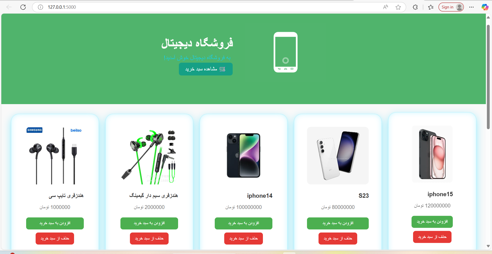
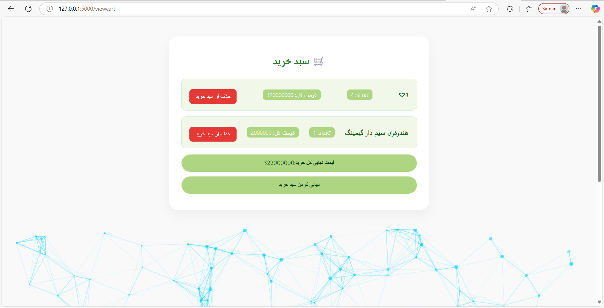
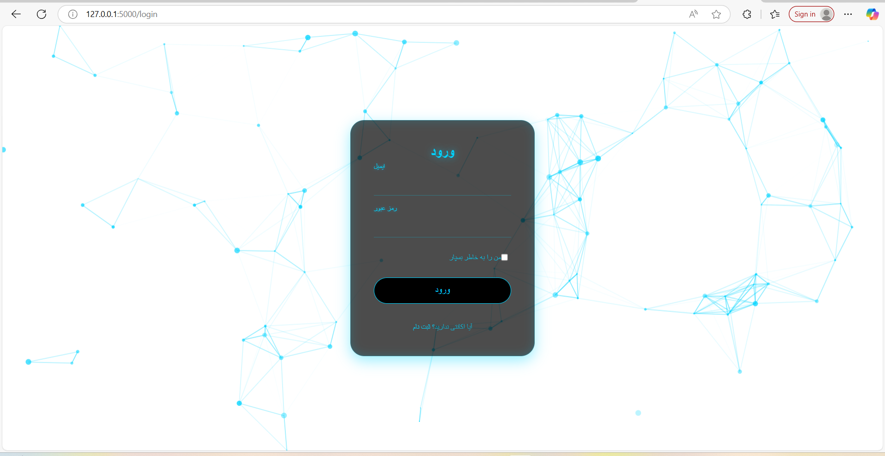
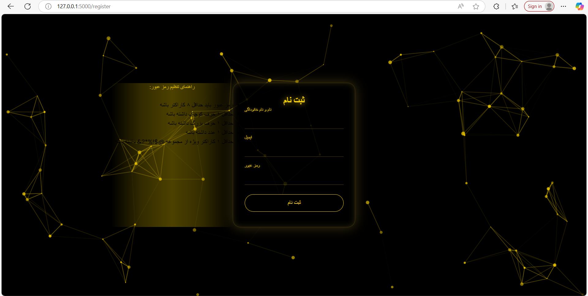
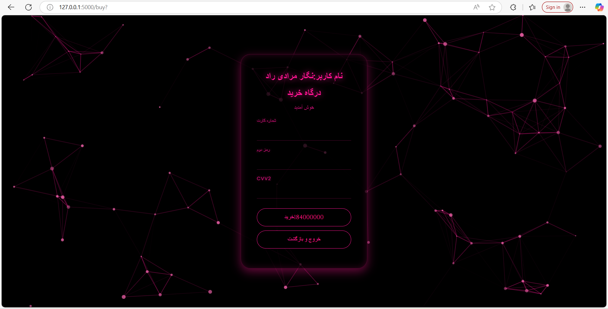

# 🛍️ CartFlow — A Minimal Flask-Based Shopping Cart System

CartFlow is a simple yet complete shopping cart and checkout system built with **Flask**, **MongoDB**, **vanilla HTML/CSS** and **JavaScript**.  
It allows users to register, login, add products to cart, and simulate a secure checkout — all while storing data dynamically in a NoSQL database.

---

## 🚀 Features

- 🧾 **User Registration & Login**  
- 🛒 **Shopping Cart (Cookie-based)**  
- 💳 **Simulated Payment Gateway** with card validation  
- 📦 **MongoDB Integration**  
- 🔐 **Session Management**  
- 📁 **Responsive Design** using custom CSS  
- 🧠 **"Remember Me" option** with permanent session support

---

## 📸 Screenshots

| dashboard | Cart | login |register | buy
|-------|------|---------|---------|---------|
|  |  |  |  |  |

---

## ⚙️ Technologies Used

- **Python 3.11+**
- **Flask**
- **MongoDB (PyMongo)**
- **bcrypt** (for password hashing)
- **HTML5 / CSS3**

---

## Open your browser at http://127.0.0.1:5000
python app.py

## 📌 To-Do / Ideas for Future
Add real payment gateway support (e.g., Stripe)

Add admin panel for product management

Dockerize the project for easy deployment

## Programmer
Developed with ❤️ by Negar Moradi Rad
